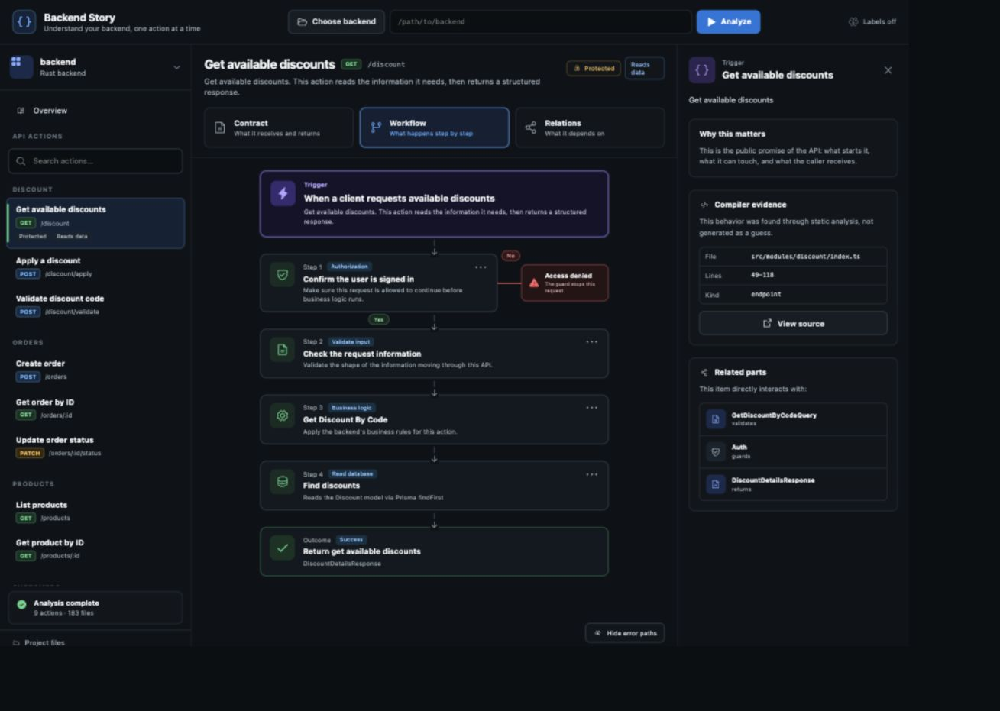

# Backend Story

[](https://github.com/mohit-kota/backend-story/actions/workflows/ci.yml)
[](LICENSE)
[](PRODUCT_ROADMAP.md)

**Understand an API before you change it.**

Backend Story is a local, compiler-first workbench that turns a TypeScript
backend into source-linked views of its API contracts, execution flow,
dependencies, and database access. The long-term question is simple:

> What should I improve in this API—and why?



> [!WARNING]
> Backend Story is an early prototype. It is useful for exploration, but its
> findings are not a substitute for code review, query plans, or production
> telemetry. Expect breaking changes before the first stable release.

## Why Backend Story

Code graphs often show that two things are connected without explaining what
an engineer should do next. Backend Story is being built around improvement
workflows instead:

- Follow one API from route to middleware, services, helpers, and Prisma.
- See every resolved database operation with its source location.
- Group repeated-read candidates and estimate avoidable round trips.
- Read SQL-shaped interpretations of supported Prisma calls.
- Keep deterministic compiler evidence separate from heuristic or AI output.
- Add production context and grounded chat without making an LLM the source of
  truth.

Analysis happens locally and the selected repository is never executed.

## Current support

| Capability | Status |
| --- | --- |
| TypeScript and JavaScript parsing with Oxc | Prototype |
| Elysia route and contract discovery | Prototype |
| Cross-file service and helper resolution | Prototype |
| Prisma model and operation extraction | Prototype |
| Contract, Workflow, Relations, and Data views | Prototype |
| Source file and line evidence | Prototype |
| Duplicate-read candidates and round-trip estimates | Prototype |
| SQL-shaped Prisma interpretations | Prototype, partial coverage |
| Optional local Ollama explanations | Prototype |
| Production telemetry and grounded chat | Planned |

See the [product roadmap](PRODUCT_ROADMAP.md) for the current/next/later plan
and [development plan](DEVELOPMENT_PLAN.md) for compiler milestones.

## Current limitations

- The framework adapter is focused on Elysia and the data adapter on Prisma.
- Dynamic route construction, aliases, barrel re-exports, and transaction
  clients are not fully resolved.
- SQL previews are interpretations, not database-observed SQL. Exact generated
  SQL depends on Prisma, the database provider, schema mapping, and runtime
  values.
- Duplicate reads are candidates. Authorization, tenancy, freshness, or
  transaction boundaries can make repeated access intentional.
- Large repositories are analyzed as a complete project; incremental storage
  and graph patches are planned.
- Ollama is optional. Disabling it does not change compiler-derived facts.

## Install and run

### Requirements

- [Rust](https://www.rust-lang.org/tools/install) 1.96 or newer
- [Bun](https://bun.sh/) 1.3 or newer
- [Tauri 2 prerequisites](https://v2.tauri.app/start/prerequisites/) for your OS
- Optional: [Ollama](https://ollama.com/) with a generative model

```bash
git clone https://github.com/mohit-kota/backend-story.git
cd backend-story
bun install
bun run dev
```

Select a backend folder in the native window and choose **Analyze**. For the
built-in demo in a browser-only session:

```bash
bun run dev:web
# open http://127.0.0.1:1420/?demo=1
```

The browser demo does not have native folder selection or Rust analysis.

### CLI

The Rust analyzer can emit the same report without the desktop client:

```bash
cargo run -p analyzer-cli -- /absolute/path/to/backend > analysis.json
```

### Optional local AI

Backend Story queries Ollama at `http://127.0.0.1:11434` and only enables AI
actions when it finds a generative model. Embedding-only models are ignored for
explanations.

```bash
ollama list
ollama pull qwen3.5:9b
```

Compiler evidence remains authoritative. AI output is bounded, optional, and
labelled as an interpretation.

## Architecture

```text
Repository folder
      │
      ▼
Rust discovery → Oxc AST → framework/Prisma adapters → canonical report
                                                           │
                                                           ▼
                                               Tauri commands/events
                                                           │
                                                           ▼
                                             React evidence views
```

Read [docs/ARCHITECTURE.md](docs/ARCHITECTURE.md) for the end-to-end design and
trust boundaries.

## Development

```bash
bun install
bun run check:web
bun run build:web
cargo fmt --all -- --check
cargo test --workspace
```

Issues and small, evidence-backed pull requests are welcome. Start with
[CONTRIBUTING.md](CONTRIBUTING.md), and read [SECURITY.md](SECURITY.md) before
reporting a vulnerability.

## Project principles

1. Compiler facts before AI narration.
2. Evidence before recommendations.
3. One API investigation before repository-wide scoring.
4. Local-first analysis and explicit external connections.
5. Estimates must look like estimates.

## License

Backend Story is licensed under the [Apache License 2.0](LICENSE).
